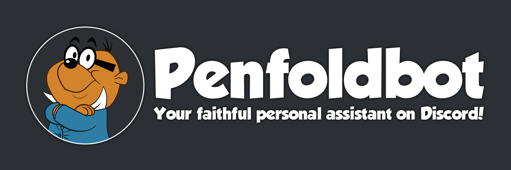

 made with :heart: by Penfoldium in Romania :romania:

# Penfold - the Discord bot :hamster::robot:

If you're looking for Penfold v1, head over to the [legacy branch](https://github.com/penfoldium/penfoldbot/tree/legacy)

### Self-hosting

Here's what you need to self-host Penfold:

- A basic text editor to edit the [configuration](./src/data/config.example.json) file
- A valid Discord bot token (get one from [here](https://discordapp.com/developers/applications))
- [Node.js](https://nodejs.org/en) LTS or newer

<!-- ### Optional stuff
These offer additional features, but the bot can run without them:
- YouTube Data API v3 key (follow the steps presented [here](https://developers.google.com/youtube/v3/getting-started))
- Genius API client (go [here](https://genius.com/api-clients))
- Spotify API client (go [here](https://developer.spotify.com/dashboard))
- Pokole (go [here](https://github.com/penfoldium/pokole)) -->

### Setup guide

- Edit the `config.example.json` file in `/src/data/` and rename it to `config.json`
- Install the required npm packages using `yarn` (if the command doesn't work, run `corepack enable` to enable yarn)
- Run the bot by running `yarn start`

_If you want to run the bot in a process manager, we recommend using **[pm2](https://pm2.keymetrics.io)**! Build the bot using `yarn build` and run the `index.js` file located inside the `dist` folder._

#### And don't forget:

> A robot could never be like Penfold.
>
> \- [Danger Mouse](#and-dont-forget '(Danger Mouse 2015, Series 1, Episode 25, "Megahurtz Attacks", 04:29)')
